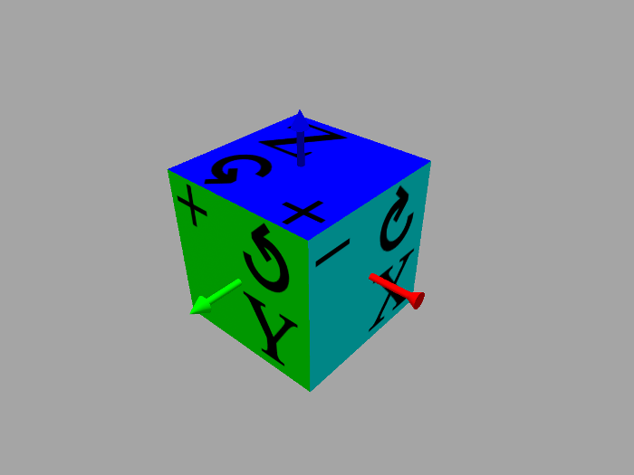
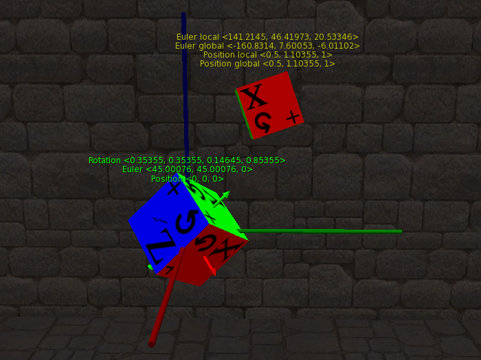

# Fourmilab Orientation Cube

[Fourmilab Orientation Cube](https://marketplace.secondlife.com/p/Fourmilab-Orientation-Cube/19823081)
is a resource for Second Life script programmers to understand
rotations and translation and how the interact with local and
global co-ordinate systems.

This repository contains all of the software and resources,
including programs in Linden Scripting Language, textures,
notecards, and development documentation, tools, and resources
used the model and its development.  The actual model is built
within Second Life and these components are installed within it.

The
[complete model](https://marketplace.secondlife.com/p/Fourmilab-Orientation-Cube/19823081)
is available for free in the Second Life Marketplace.  This
repository contains everything in the model (except the prims,
which are objects built within Second Life), plus additional
resources for developers who may wish to extend or adapt the
model as they wish.  The model is delivered with "full permissions":
those who obtain it are free to copy, modify, and transfer it to
other users within Second Life.

All of this software is licensed under the Creative Commons
Attribution-ShareAlike license.  Please see LICENSE.md in this
repository for details.
